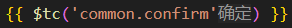
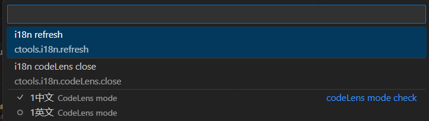

# mytools README
i18n 辅助插件
## Features

主要用以辅助开发者查看i18n对应Code在配置中的文本内容， 插件内置了`babel^7`和`typescript`编译器, 可将`ctools.i18n.options`配置的文件转成`ESM`,但仅能加载配置的文件中导出内容,并默认为一个JSON;

## Requirements

安装完成后 需要配置ctools.i18n.options 才能正常运行

## Extension Settings

* `ctools.i18n.options`: 配置一个object，键唯一， 值为配置的相对项目根目录的路径
* `ctools.i18n.apiName`: 需要匹配的i18n方法名
    - 例如：`"\\$t"`,`"\\$tcc"`,`"\\$tc"`,`"TC"`
* `ctools.i18n.codeLens.mode`: 翻译提示文本块模块设置，对应 ctools.i18n.options中的选项；可通过命令`ctools.i18n.codeLens.checkMode`设置
* `ctools.i18n.codeLens.auto`: 是否在i18n开启时自动开启 翻译提示文本块

## Extension commands 
命令 | 说明 | 参数
:---|:---|---:
ctools.i18n.commands | 快捷命令列表 | -
ctools.i18n | i18n 开启 | -
ctools.i18n.refresh | i18n 刷新 | -
ctools.i18n.codeLens | i18n 翻译提示文本块开启 | -
ctools.i18n.codeLens.checkMode | i18n 翻译提示文本块模块切换 | `String` `ctools.i18n.options`中的键
ctools.i18n.codeLens.close | i18n 翻译提示文本块关闭 | -

## Known Issues

Calling out known issues can help limit users opening duplicate issues against your extension.

## Release Notes

Users appreciate release notes as you update your extension.

### 0.1.0

Initial release

### 0.1.3

修复 i18n.refresh bug

### 0.2.0

加入`ctools.i18n.codeLens`相关功能，即**翻译提示文本块**,可根据配置的codeLens Mode展示代码对应的翻译,通过`i18n codeLens check mode`设置展示对应的翻译模块
    
### 0.2.1

* 修复 `ctools.i18n.codeLens`重复加载渲染的问题
* 加入`ctools.i18n.commands`快捷命令列表
    

优化i18n.options配置读取
* 文件路径后缀自动获取匹配 `.js`,`.ts`,`.json`
* 无效路径报错提示，并引导配置

## Following extension guidelines

Ensure that you've read through the extensions guidelines and follow the best practices for creating your extension.

* [Extension Guidelines](https://code.visualstudio.com/api/references/extension-guidelines)

## Working with Markdown

You can author your README using Visual Studio Code. Here are some useful editor keyboard shortcuts:

* Split the editor (`Cmd+\` on macOS or `Ctrl+\` on Windows and Linux).
* Toggle preview (`Shift+Cmd+V` on macOS or `Shift+Ctrl+V` on Windows and Linux).
* Press `Ctrl+Space` (Windows, Linux, macOS) to see a list of Markdown snippets.

## For more information

* [Visual Studio Code's Markdown Support](http://code.visualstudio.com/docs/languages/markdown)
* [Markdown Syntax Reference](https://help.github.com/articles/markdown-basics/)

**Enjoy!**
